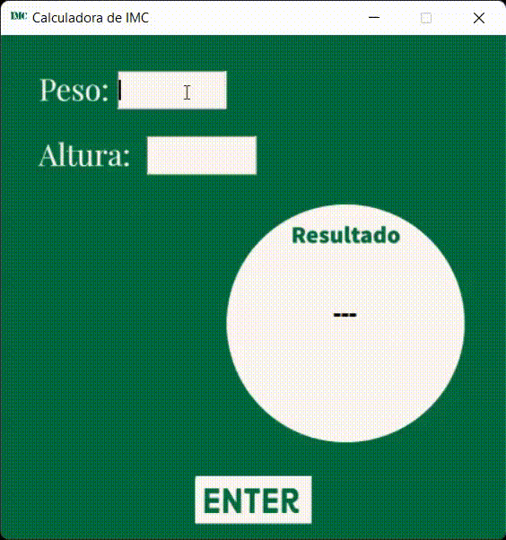

# Calculadora de IMC

Programa desenvolvido com Python. 

## 🚀 Começando

Essas instruções permitirão que você obtenha uma cópia do projeto em operação na sua máquina local para fins de desenvolvimento e teste.

### 📋 Pré-requisitos

1. Python 3.10
2. Tkinter
3. Pillow

### 🔧 Instalação

1. Visual Studio Code
2. Nuitka

### 📦 Imagens do Projeto

### 📌 Animação

 

### 📄 SOFTWARE COPYLEFT

O software copyleft é livre e tem o código-fonte aberto, porém, a principal diferença é que os seus produtores querem evitar que tal sistema seja modificado e vendido. Dessa forma, todas as alterações devem ser registradas como copyleft.(https://www.softwareone.com/pt-br/blog/artigos/2020/01/07/licenca-de-software)

### 🎁 Expressões de gratidão

* Conte a outras pessoas sobre este projeto 📢;
* Um agradecimento publicamente 🫂;
* etc.

---
⌨️ com ❤️ por [Fabíola](https://github.com/fabiolafoliveira) 😊
